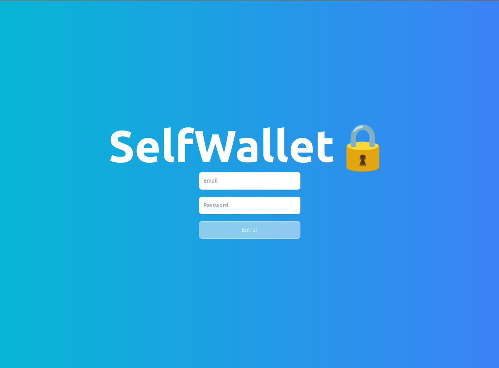
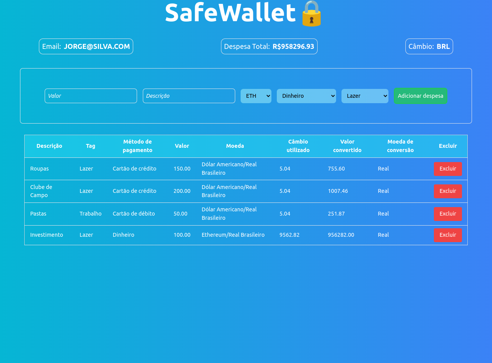

# SafeWallet🔒

### Projeto desenvolvido JavaScript, ReactJs e Redux

## Funcionalidades:
Com este projeto, você consegue criar novas despesas e excluir as mesmas cas seja necessário.

## Requisitos do projeto:
- NodeJs v16
- VSCode

## Instalação do projeto:

Clonar o projeto:
```bash
  git clone git@github.com:JovemAlex/SafeWallet.git
```

Entrar na pasta:
```bash
  cd SafeWallet
```

Abrir a pasta atual no editor de texto (VScode):
```bash
  code .
```

Instalar todas as dependências do projeto:
```bash
  npm i
```

Rodar o projeto em seu navegador:
```bash
  npm start
```




_Projeto recebe constates atualizações de estilizações e funcionalidades._